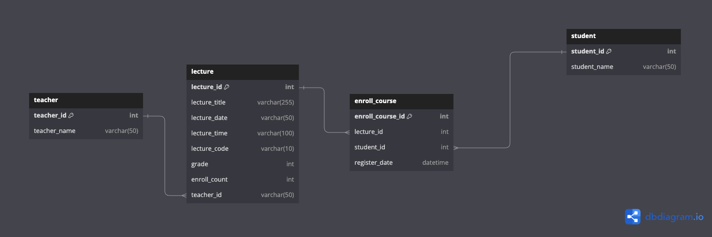

# 특강 신청 서비스

# Entity-Relationship Diagram (ERD)

## student, teacher 테이블
- 각각 테이블로 만들어서 관리 (정규화)

## lecture 테이블, enroll_course 테이블
- teacher와 lecture 1:N 관계
- lecture와 enroll_course 1:N 관계
- student와 enroll_course 1:N 관계
- 수강 인원 제한 30명 (수강인원은 컬럼으로 관리 => 조회 성능 개선을 위해서)
- 한 사람이 강의를 중복 신청 하지 못 하도록 (student_id, lecture_id) unique 처리

